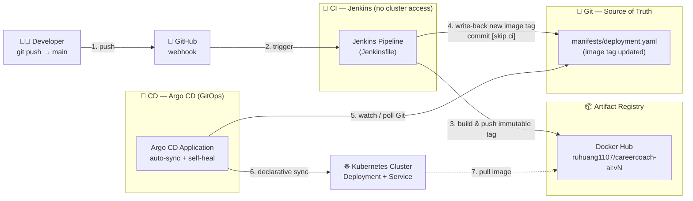
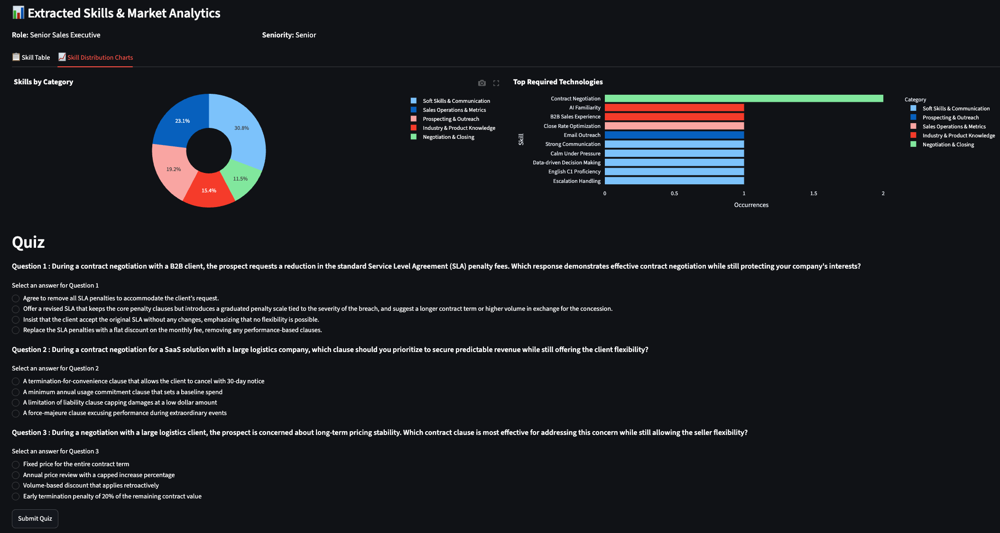
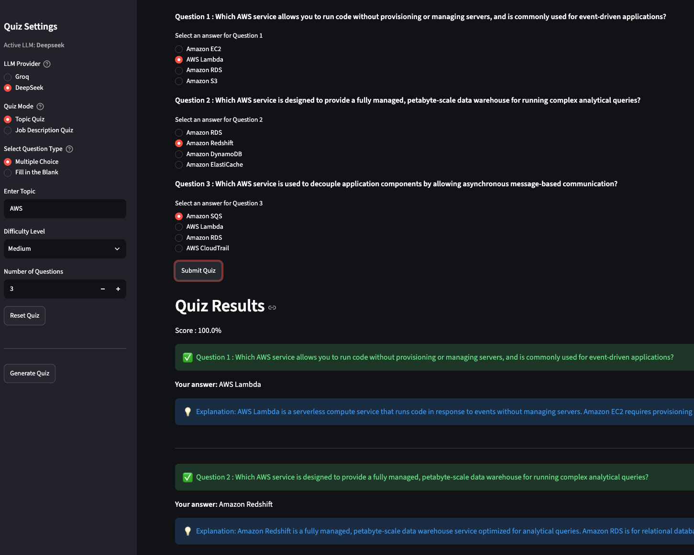
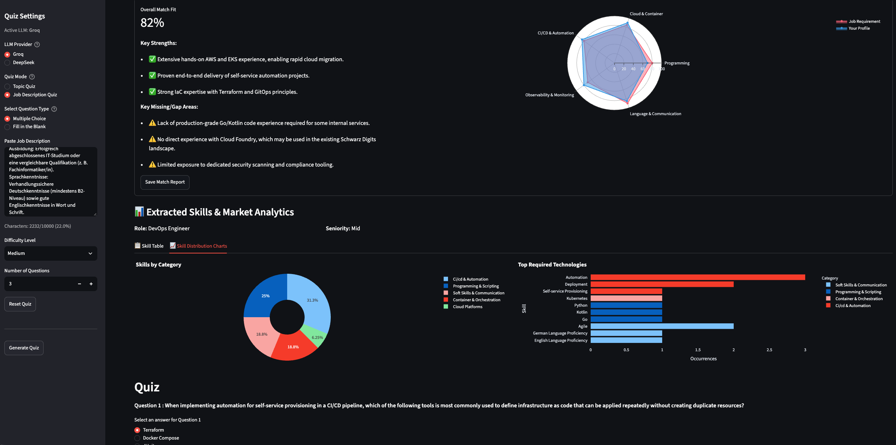
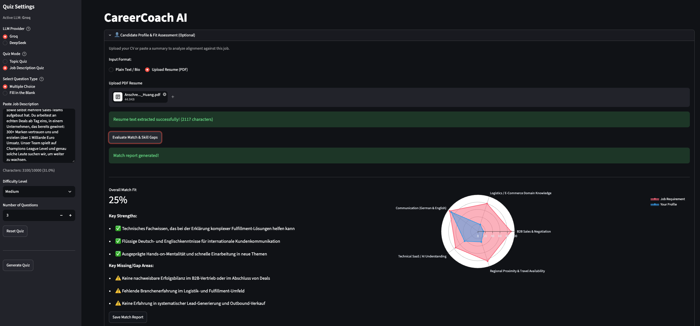

<div align="center">

# 🎯 CareerCoach AI

**A Streamlit LLM app — used as a demo workload to showcase a production-grade, GitOps-driven CI/CD platform.**

[](Jenkinsfile)
[](manifests/)
[](manifests/)
[](Dockerfile)
[](requirements.txt)
[](application.py)

</div>

---

## 📌 TL;DR for Hiring Managers

This repository is a **platform engineering showcase**. The application itself (an LLM-powered quiz generator) is intentionally simple — the value is in the **delivery platform** wrapped around it:

| Capability | Implementation |
| --- | --- |
| **CI** | Jenkins declarative pipeline — build, immutable tag, push, manifest write-back |
| **CD** | Argo CD GitOps — declarative sync, automated self-heal |
| **Decoupling** | CI never touches the cluster; CD never builds artifacts |
| **Security** | No kubeconfig in CI, least-privilege RBAC, secrets via K8s `Secret` refs |
| **Immutability** | Every deploy is a unique `v${BUILD_NUMBER}` tag — `latest` is never deployed |
| **Loop safety** | `[skip ci]` commit interception prevents CI self-triggering |

---

## 🏗️ Architecture

The pipeline follows a strict **CI/CD decoupling** model: Jenkins produces artifacts and writes desired state to Git; Argo CD reconciles that state into the cluster. **Git is the single source of truth.**



### Workflow — step by step

1. **Push** — A developer pushes to `main`.
2. **Trigger** — GitHub fires a webhook → the Jenkins pipeline starts.
3. **Build & push** — Jenkins builds a multi-stage Docker image tagged `v${BUILD_NUMBER}` (immutable) and pushes it to Docker Hub (`ruhuang1107/careercoach-ai`).
4. **Write-back** — Jenkins `sed`-updates the image tag in [`manifests/deployment.yaml`](LLM-Projects/CareerCoach-AI/manifests/deployment.yaml:17) and commits with `[skip ci]`. The pipeline intercepts this commit on the next run and aborts, preventing a trigger loop.
5. **Reconcile** — Argo CD detects the Git change and syncs the cluster declaratively.
6. **Self-heal** — Any manual drift in the cluster is automatically reverted to match Git.
7. **Image pull** — The kubelet pulls the new immutable tag from Docker Hub (a runtime action, not a pipeline stage).

> **Why decoupled?** Jenkins holds *only* Git + registry credentials. It has **no cluster access**. Argo CD holds *only* cluster credentials. A compromise of CI cannot reach production.

---

## 📂 Repository Layout

```text
CareerCoach-AI/
├── application.py              # Streamlit entrypoint
├── src/                        # Application source (LLM clients, generators, parsers)
├── Dockerfile                  # Multi-stage build → non-root runtime
├── Jenkinsfile                 # CI pipeline (build → push → manifest write-back)
├── manifests/
│   ├── deployment.yaml         # K8s Deployment (image tag mutated by CI)
│   └── service.yaml            # K8s Service (NodePort → Streamlit 8501)
├── .env.example                # Provider key template (never commit real keys)
└── public/images/              # UI screenshots
```

---

## 🚀 Part 1 — Local Development

**Prerequisites:** Python 3.10+, Git.

```bash
cd CareerCoach-AI
python -m venv .venv && source .venv/bin/activate
pip install --upgrade pip
pip install -r requirements.txt
pip install -e .
```

Configure provider keys by copying the template (never commit `.env`):

```bash
cp .env.example .env
```

```dotenv
# Groq (optional)
GROQ_API_KEY=gsk_xxxxxxx

# DeepSeek (optional)
DEEPSEEK_API_KEY=sk_xxxxxxx
```

Run the app:

```bash
streamlit run application.py
```

---

## 🔨 Part 2 — CI Setup (Jenkins)

### 2.1 Install required plugins

`Manage Jenkins → Plugins` → install, then restart Jenkins:

- **Docker**
- **Docker Pipeline**
- **Kubernetes**
- **GitHub** (for webhook triggers)

Ensure the Jenkins agent has the Docker CLI available (or runs as a container with the Docker socket mounted).

### 2.2 Create scoped credentials

Store **all** credentials in `Manage Jenkins → Credentials → Global`. Never inline secrets in the `Jenkinsfile`.

| Credential ID | Type | Purpose | Scope |
| --- | --- | --- | --- |
| `github-token` | Username/Password | Checkout + manifest write-back | `repo`, `admin:repo_hook` |
| `CareerCoach-Dockerhub` | Username/Password | Push to Docker Hub | Read/Write token |

**GitHub token** — `GitHub → Settings → Developer settings → Personal access tokens (classic)`:

```text
repo
admin:repo_hook
workflow
```

**Docker Hub token** — `Docker Hub → Account Settings → Security → New Access Token` (Read/Write).

### 2.3 Create the pipeline job

`Jenkins Dashboard → New Item → Pipeline`:

| Field | Value |
| --- | --- |
| Name | `gitops` |
| Definition | Pipeline script from SCM |
| SCM | Git |
| Repository URL | `https://github.com/Ru-Dipity/CareerCoach-AI.git` |
| Credentials | `github-token` |
| Branch | `*/main` |
| Script Path | `Jenkinsfile` |

### 2.4 Configure the webhook trigger

`GitHub repo → Settings → Webhooks → Add webhook`:

| Field | Value |
| --- | --- |
| Payload URL | `http://<JENKINS_HOST>:8080/github-webhook/` |
| Content type | `application/json` |
| Events | Just the push event |

Then in the Jenkins job: `Configure → Build Triggers → ✅ GitHub hook trigger for GITScm polling`.

### 2.5 Pipeline stages

The [`Jenkinsfile`](LLM-Projects/CareerCoach-AI/Jenkinsfile:1) runs these stages:

| Stage | Action |
| --- | --- |
| **Pipeline Orchestrator** | Checkout `main`, inspect last commit, **loop interception** |
| **Build Docker Image** | `docker.build("ruhuang1107/careercoach-ai:v${BUILD_NUMBER}")` |
| **Push Image to DockerHub** | Push immutable tag via `withRegistry` |
| **Update Deployment YAML** | `sed` the image tag in `manifests/deployment.yaml` |
| **Commit Updated YAML** | Commit `[skip ci]` + `git pull --rebase` + push |

**Loop prevention** — the pipeline aborts immediately if the last commit contains `[skip ci]` or `chore(ci): Update image tag`, so the write-back commit cannot re-trigger CI:

```groovy
def lastCommit = sh(script: 'git log -1 --pretty=%B', returnStdout: true).trim()
if (lastCommit.contains('[skip ci]') || lastCommit.contains('chore(ci): Update image tag')) {
    echo ">>> Intercepted automated commit. Aborting to prevent loop! <<<"
    currentBuild.result = 'SUCCESS'
    return
}
```

---

## 🚀 Part 3 — CD Setup (Argo CD / GitOps)

### 3.1 Install Argo CD

```bash
kubectl create namespace argocd
kubectl apply -n argocd -f https://raw.githubusercontent.com/argoproj/argo-cd/stable/manifests/install.yaml

# Verify all components are healthy
kubectl get all -n argocd
```

### 3.2 Expose the UI

`argocd-server` defaults to `ClusterIP`. Switch it to `NodePort` (or front it with an Ingress):

```bash
kubectl patch svc argocd-server -n argocd \
  -p '{"spec": {"type": "NodePort"}}'

kubectl get svc -n argocd
```

### 3.3 Retrieve the admin password

```bash
kubectl get secret -n argocd argocd-initial-admin-secret \
  -o jsonpath="{.data.password}" | base64 -d
# Username: admin
```

### 3.4 Connect the Git repository

`Argo CD UI → Settings → Repositories → Connect Repo via HTTPS`:

| Field | Value |
| --- | --- |
| Type | `git` |
| Project | `default` |
| Repo URL | `https://github.com/Ru-Dipity/CareerCoach-AI.git` |
| Username / Password | GitHub username + token (recommended) |

### 3.5 Provision the application secret

The Deployment consumes `GROQ_API_KEY` from a Kubernetes `Secret` — **never** from Git:

```bash
kubectl create secret generic groq-api-secret \
  --from-literal=GROQ_API_KEY="<your-key>" \
  -n argocd
```

> For production, replace this with **External Secrets Operator**, **SealedSecrets**, or **Vault** so secrets are never handled imperatively.

### 3.6 Create the Argo CD Application

`Applications → New App`:

| Field | Value |
| --- | --- |
| Name | `careercoach-app` |
| Project | `default` |
| Sync Policy | **Automatic** |
| Prune / Self-Heal | ✅ enabled |
| Repository URL | connected repo |
| Revision | `main` |
| Path | `manifests` |
| Cluster URL | `https://kubernetes.default.svc` |
| Namespace | `default` |

Equivalent CLI:

```bash
argocd app create careercoach-app \
  --repo https://github.com/Ru-Dipity/CareerCoach-AI.git \
  --path manifests \
  --dest-server https://kubernetes.default.svc \
  --dest-namespace default \
  --sync-policy automated \
  --self-heal
```

The app should report **Synced** and **Healthy**.

### 3.7 Verify the end-to-end flow

```bash
# 1. Make a trivial change and push to main
git commit --allow-empty -m "chore: trigger pipeline" && git push

# 2. Watch Jenkins build → push → write-back
# 3. Watch Argo CD reconcile the new tag
argocd app get careercoach-app
argocd app sync careercoach-app   # only needed if auto-sync is off
```

---

## 🛡️ Engineering Highlights

### Least-privilege security — no kubeconfig in CI

- **Jenkins** holds only Git and registry credentials — it has **zero cluster access**.
- **Argo CD** holds cluster credentials scoped to a minimal RBAC role (`get`/`list`/`watch`/`patch` on required resources only).
- No `kubeconfig` is ever checked into Git or passed to CI in plaintext.

### Immutable image tags

Every build produces a unique `v${BUILD_NUMBER}` tag. `latest` is **never** deployed to production, guaranteeing reproducible rollbacks and eliminating tag-mutation races.

### GitOps self-healing

Argo CD continuously reconciles the cluster against Git. Manual `kubectl edit` drift is automatically reverted — the cluster converges to the declared state.

### Manifest write-back with loop safety

CI commits the new image tag with `[skip ci]`, and the pipeline intercepts its own commits before building — preventing infinite trigger loops.

### Secrets management

Application secrets are injected via Kubernetes `Secret` references ([`deployment.yaml`](LLM-Projects/CareerCoach-AI/manifests/deployment.yaml:20)), keeping credentials out of Git entirely.

### Container hardening

The [`Dockerfile`](LLM-Projects/CareerCoach-AI/Dockerfile:1) uses a **multi-stage build** (build tools excluded from the runtime image), runs as a **non-root user** (`appuser`, UID 1000), and ships a `HEALTHCHECK` against Streamlit's `/_stcore/health` endpoint.

---

## ✅ Interview Demo Checklist

- [ ] CI builds the image and pushes an **immutable** tag
- [ ] CI commits the manifest update with `[skip ci]` (loop-safe)
- [ ] Argo CD watches Git and syncs automatically with **self-heal**
- [ ] Secrets stored outside Git (Vault / ExternalSecrets / SealedSecrets)
- [ ] Minimal RBAC for Argo CD; **no kubeconfig in CI**
- [ ] Readiness/liveness probes and resource limits defined in manifests
- [ ] Monitoring + dashboards (Prometheus + Grafana) wired to the cluster

---

## 🖼️ Screenshots

| Quiz UI | Quiz Results |
| --- | --- |
|  |  |

| Candidate Match Report | Skill Analytics |
| --- | --- |
|  |  |

---

## 🗺️ Roadmap

- [ ] Add readiness/liveness probes and resource limits to [`manifests/deployment.yaml`](LLM-Projects/CareerCoach-AI/manifests/deployment.yaml:1)
- [ ] Introduce Kustomize overlays for `dev` / `staging` / `prod`
- [ ] Add image scanning (Trivy) and signing (Cosign) to the CI pipeline
- [ ] Scaffold a `terraform/` module to provision the cluster, registry, and Argo CD
- [ ] Migrate secrets to External Secrets Operator
